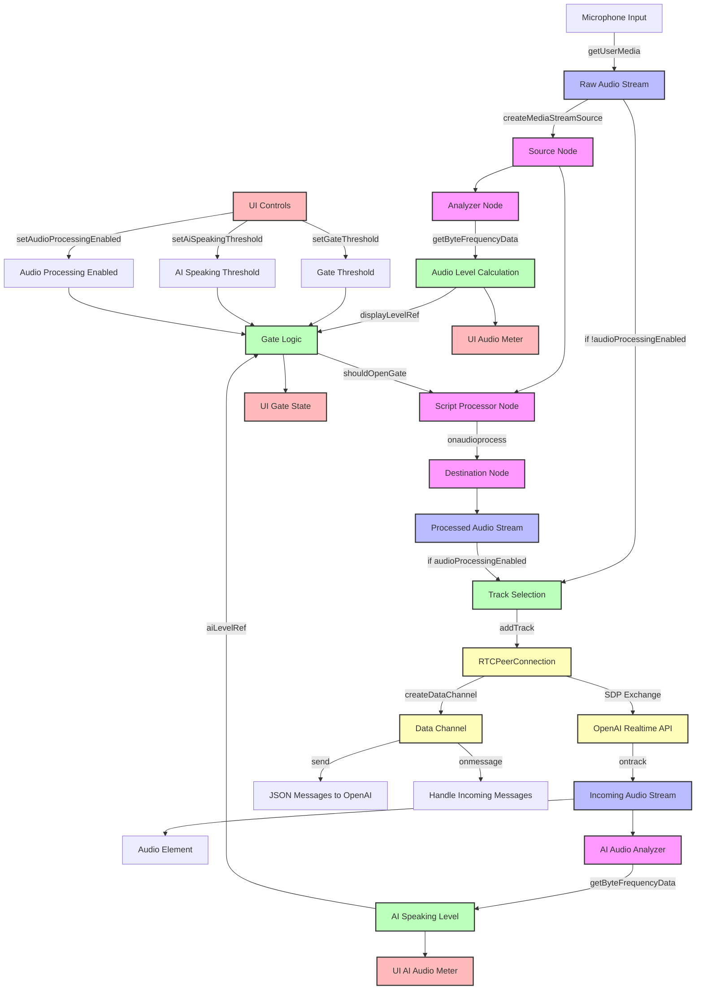

# Audio Routing Diagram for WebRTC Application

## Audio Processing Flow Explanation

### 1. Audio Capture and Initial Processing
- **Microphone Input**: Captured using `navigator.mediaDevices.getUserMedia()`
- **Raw Audio Stream**: The unprocessed audio from the microphone
- **Source Node**: Created from the raw stream using `audioContext.createMediaStreamSource()`
- **Analyzer Node**: Used for real-time level metering of the raw audio

### 2. Noise Gate Processing
- **Audio Level Calculation**: Analyzes frequency data to determine current audio level in dB
- **Gate Logic**: Determines if audio should pass through based on:
  - Current microphone level vs. gate threshold
  - Whether AI is currently speaking (to prevent feedback)
  - Whether audio processing is enabled
- **Script Processor Node**: Applies the gate by either:
  - Passing through audio samples when gate is open
  - Outputting silence (zeros) when gate is closed
- **Destination Node**: Creates a processed MediaStream with the gated audio

### 3. Track Selection
- Based on `audioProcessingEnabled` state:
  - If enabled: Uses the processed (gated) audio track
  - If disabled: Uses the raw audio track directly
- The selected track is added to the RTCPeerConnection

### 4. WebRTC Connection
- **RTCPeerConnection**: Manages the WebRTC connection to OpenAI
- **SDP Exchange**: Negotiates the connection with OpenAI's Realtime API
- **Data Channel**: Sends and receives JSON messages for text and control

### 5. Return Audio Path
- **Incoming Audio Stream**: Audio received from OpenAI
- **Audio Element**: Plays the AI's voice response
- **AI Audio Analyzer**: Monitors the AI's audio level to detect when it's speaking

### 6. User Interface
- **UI Audio Meters**: Display microphone and AI audio levels
- **UI Gate State**: Shows whether the gate is open or closed
- **UI Controls**: Allow adjusting thresholds and toggling audio processing

## Key Components in Code

1. `setupAudioVisualization()`: Creates the audio processing chain
2. `updateAudioProcessingState()`: Toggles between processed and raw audio
3. `startSession()`: Establishes the WebRTC connection
4. `configureDataChannel()`: Sets up communication with OpenAI
5. `GateSettings` component: Provides UI controls for the audio processing

## Audio Processing Control Flow

When audio processing is enabled:
1. Raw audio → Script Processor → Gate Logic → Processed Stream → OpenAI
2. Gate opens only when:
   - Mic level > Gate threshold
   - AI is not speaking
   - Audio processing is enabled

When audio processing is disabled:
1. Raw audio → OpenAI (bypassing the gate) 